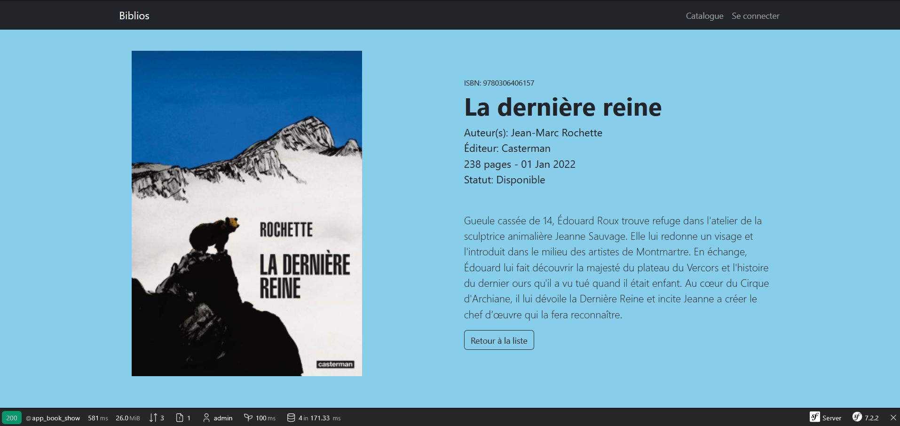

# Learning Symfony 7

This is my first introduction to Symfony. I'm learning through the [OpenClassrooms tutorial](https://openclassrooms.com/fr/courses/8264046-construisez-un-site-web-a-laide-du-framework-symfony-7), which focuses on:

    - Setting up a Symfony project
    - Creating dynamic pages with Twig
    - Implementing user authentication and management
    - Exploring advanced features and best practices

